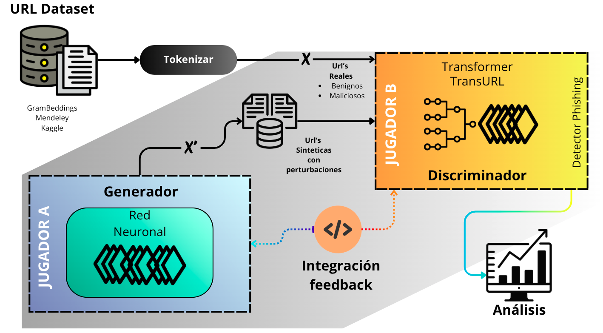

# TRANSURL_GAN_TRABAJO_DE_INVESTIGACION

# Detección de URLs Maliciosas con Aprendizaje Adversarial -  TransURL_GAN
### Un enfoque basado en Transformers y GANs para Ciberseguridad

## Descripción general del proyecto

Este proyecto aborda uno de los problemas más críticos de la ciberseguridad moderna: la detección temprana de URLs maliciosas utilizadas en ataques de phishing, distribución de malware y fraudes en línea. Las técnicas tradicionales (listas negras, heurísticas y machine learning clásico) presentan limitaciones frente a URLs dinámicas y estrategias de evasión cada vez más sofisticadas.

La propuesta se centra en un modelo híbrido que combina arquitecturas **Transformer (TransURL)** con **Redes Generativas Antagónicas (GANs)**. El objetivo es no solo clasificar URLs como benignas o maliciosas, sino también **incrementar la robustez del sistema frente a ataques adversariales**, entrenando al clasificador con perturbaciones internas generadas artificialmente que simulan comportamientos reales de atacantes.

En este enfoque, el Transformer actúa como discriminador principal (defensor), mientras que la GAN introduce perturbaciones adversariales en el espacio latente (atacante). Esta dinámica permite que el modelo aprenda fronteras de decisión más estables y generalizables, mejorando su desempeño en escenarios reales de ciberataques.

---

## Problema abordado

Los modelos actuales basados en Transformers muestran un excelente rendimiento en condiciones normales, pero presentan vulnerabilidades ante pequeñas perturbaciones en la estructura interna de las URLs. Estas variaciones, aunque mínimas, pueden ser suficientes para evadir los sistemas de detección.

El problema central es la **baja adaptabilidad de los clasificadores frente a URLs generadas o modificadas adversarialmente**, lo que reduce su capacidad de generalización y su efectividad ante amenazas emergentes.

---

## Objetivo del proyecto

Desarrollar un sistema robusto para la detección de URLs maliciosas que:

- Combine clasificación contextual con Transformers y generación adversarial con GANs.
- Mejore la resistencia del modelo frente a perturbaciones internas y ataques dinámicos.
- Aumente la precisión y la capacidad de generalización en múltiples conjuntos de datos.
- Simule un entorno realista de ataque–defensa para fortalecer el clasificador.

---

## Propuesta

La solución implementa un esquema adversarial donde:

- **TransURL (Transformer)** aprende representaciones profundas de las URLs y realiza la clasificación principal (benigna/maliciosa).
- **Un Generador GAN** produce perturbaciones controladas sobre el embedding latente del Transformer.
- El discriminador es entrenado simultáneamente con URLs reales y versiones adversariales, obligándolo a mantener decisiones consistentes incluso bajo ataque.

A diferencia de las GAN tradicionales que generan datos completos, aquí el generador actúa directamente sobre el **espacio latente**, permitiendo evaluar vulnerabilidades internas del modelo sin modificar explícitamente la URL textual.

Este entrenamiento adversarial se formula como un juego de suma cero entre atacante y defensor, lo que conduce a un clasificador más estable y resistente.

---

## Pipeline del sistema

El flujo general del modelo híbrido GAN–Transformer es el siguiente:

> **Nota:** Coloca la imagen del pipeline en el repositorio con el nombre `pipeline.png` (correspondiente al esquema metodológico GAN–TransURL).

---

## Resultados generales

Los experimentos se realizaron sobre múltiples datasets representativos del dominio (GramBeddings, Kaggle, PhishTank y Mendeley), evaluando tanto el modelo supervisado base (TransURL) como su versión adversarial (GAN–TransURL).

De forma general, los resultados muestran que:

- El modelo Transformer base alcanza altos niveles de desempeño, con F1-score cercanos al **97%** en su conjunto original.
- Al incorporar el entrenamiento adversarial, el sistema mantiene una precisión elevada y **mejora su robustez frente a perturbaciones internas**.
- El modelo GAN–TransURL presenta una mayor estabilidad en la frontera de decisión y una mejor capacidad de generalización ante URLs no vistas.
- Las curvas de pérdida del generador y discriminador evidencian un entrenamiento adversarial estable.
- Las métricas AUC y F1 confirman que el enfoque híbrido reduce la vulnerabilidad del clasificador frente a ataques adversariales.

En conjunto, los resultados demuestran que integrar GANs con Transformers fortalece significativamente los sistemas de detección de phishing, haciéndolos más adecuados para entornos reales de ciberseguridad.

---

## Enfoque en Ciberseguridad

Este proyecto se enmarca directamente en la ciberseguridad aplicada, específicamente en:

- Detección de phishing.
- Clasificación de URLs maliciosas.
- Defensa contra ataques adversariales.
- Robustecimiento de modelos de aprendizaje profundo.
- Protección proactiva frente a amenazas emergentes.

La arquitectura propuesta busca contribuir al desarrollo de sistemas inteligentes capaces de anticipar y resistir técnicas modernas de evasión utilizadas por atacantes.

---

## Autor

**Manuel Angel Nifla Llallacachi**  
Bachiller en Ciencia de la Computación  
Universidad Nacional de San Agustín de Arequipa, Perú

---

## Licencia

Este proyecto se comparte con fines académicos y de investigación.
